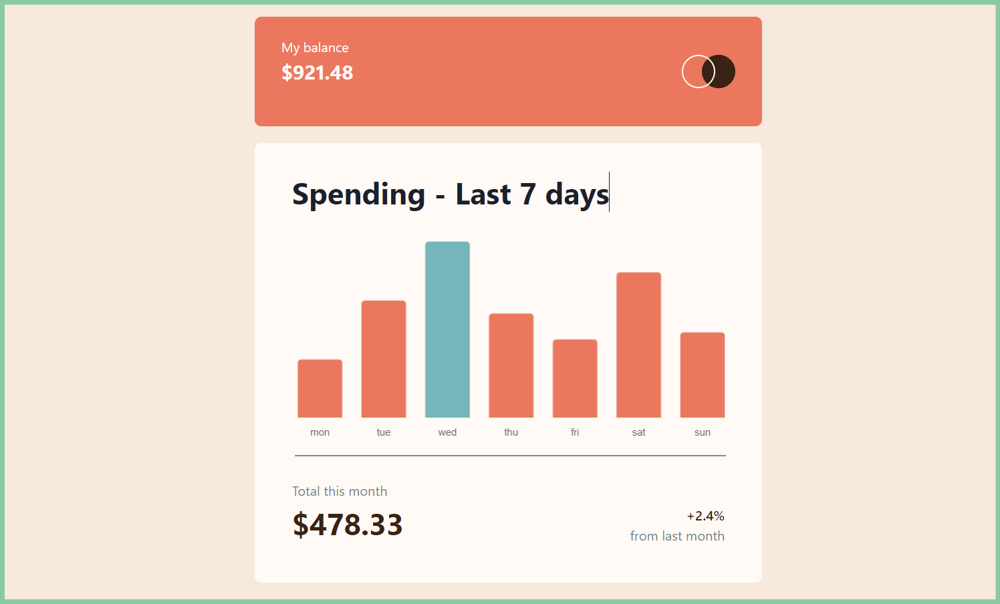

# Frontend Mentor - Expenses chart component solution

This is a solution to the [Expenses chart component challenge on Frontend Mentor](https://www.frontendmentor.io/challenges/expenses-chart-component-e7yJBUdjwt). Frontend Mentor challenges help you improve your coding skills by building realistic projects. 

### Screenshot

- Solution URL: (https://tome-expenses-chart.netlify.app/)
- Live Site URL: (https://github.com/Tome190/expenses-chart-component-main)

## My process

### Built with

- Semantic HTML5 markup
- CSS custom properties
- Flexbox
- CSS Grid
- [React](https://reactjs.org/) - JS library
- [Vite](https://vitejs.dev/) - JS Bundler
- [Chakra UI](https://chakra-ui.com/) - For styles

## Author

- Frontend Mentor - (https://www.frontendmentor.io/Grasit/yourusername)

